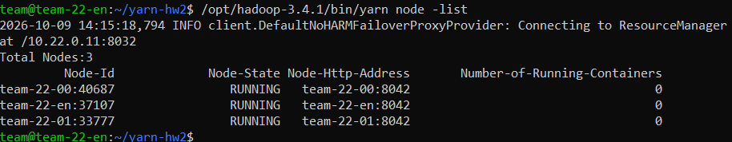
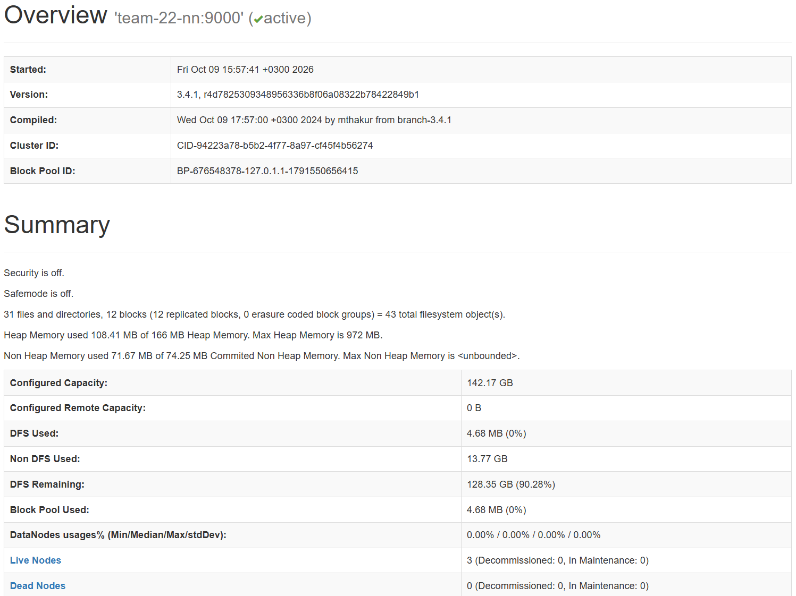
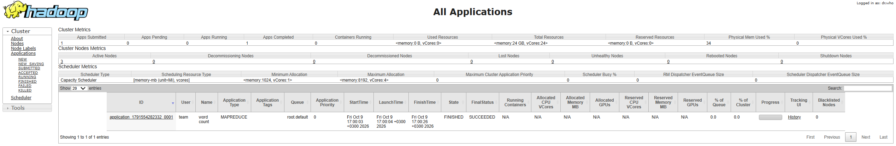
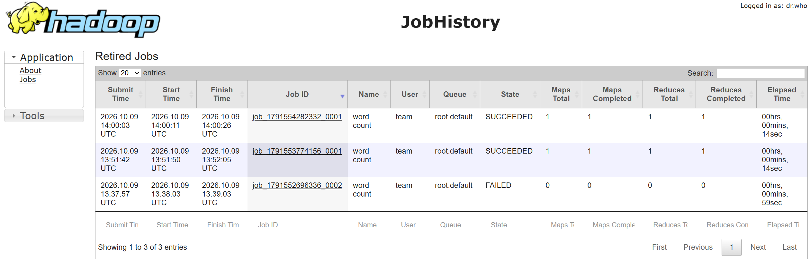
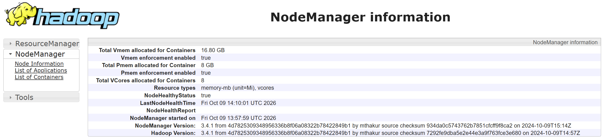
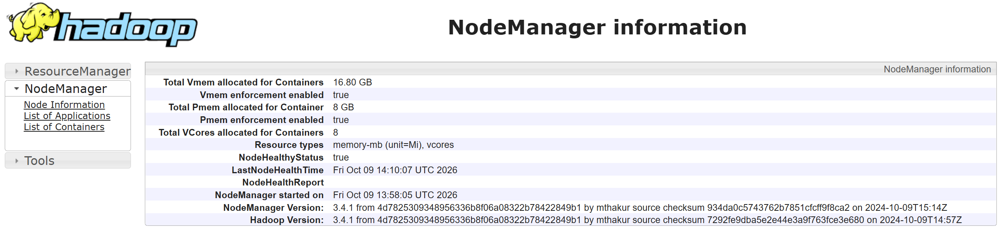

# Hadoop YARN

## Архитектура

HW2 разворачивается поверх HDFS-кластера из HW1.

Используются 4 виртуальные машины:

| Host | IP | Роль |
|---|---|---|
| `team-22-en` | `10.22.0.10` | Edge, DataNode, SecondaryNameNode, NodeManager, JobHistoryServer, nginx |
| `team-22-nn` | `10.22.0.11` | NameNode, ResourceManager |
| `team-22-00` | `10.22.0.12` | DataNode, NodeManager |
| `team-22-01` | `10.22.0.13` | DataNode, NodeManager |

ResourceManager расположен на `10.22.0.11`

NodeManager запускается на: `10.22.0.10, 10.22.0.12, 10.22.0.13`

JobHistoryServer запускается на `10.22.0.10`

Схема:

                         10.22.0.11
                 NameNode + ResourceManager
                           |
              +------------+------------+
              |            |            |
              v            v            v
         10.22.0.10   10.22.0.12   10.22.0.13
          DataNode      DataNode      DataNode
        NodeManager   NodeManager   NodeManager
            |
            +-- SecondaryNameNode
            +-- JobHistoryServer
            +-- nginx

## Конфигурация

### yarn-site.xml

ResourceManager расположен на: `10.22.0.11`

ResourceManager и NodeManager слушают: `0.0.0.0`

Для выполнения MapReduce используется: `mapreduce_shuffle`

### mapred-site.xml

MapReduce запускается через YARN: `mapreduce.framework.name = yarn`

Для ApplicationMaster, map и reduce контейнеров задается:

```HADOOP_MAPRED_HOME=/opt/hadoop-3.4.1

JobHistoryServer:

RPC: 10.22.0.10:10020  
Web UI: 0.0.0.0:19888```

# backup-hw1.sh

`scripts/backup-hw1.sh` сохраняет состояние HW1 перед изменениями HW2.

Backup создается в: `backup/hw1-baseline`

Если backup уже существует, повторно он не создается.

Для каждой машины сохраняются:

```core-site.xml  
hdfs-site.xml  
workers  
yarn-site.xml  
mapred-site.xml  
/etc/hosts  
jps```

На edge дополнительно сохраняется результат: `hdfs dfsadmin -report`

Backup используется при выполнении `rollback.sh`

# deploy.sh

`deploy.sh` запускается на edge поверх развернутого HW1.

## 1. Проверка HW1

Проверяется наличие Hadoop: `/opt/hadoop-3.4.1`

Также проверяется состояние HDFS: `Live datanodes (3)`

Если доступны не все 3 DataNode, deployment прекращается.

## 2. Создание baseline

Запускается: `scripts/backup-hw1.sh`

Если baseline уже существует, он не изменяется.

## 3. Настройка hostname

На исходных VM FQDN локального узла также разрешался через: `127.0.1.1`

Из-за этого MapReduce-контейнеры могли пытаться подключаться к ApplicationMaster через loopback.

`deploy.sh` удаляет конфликтующие записи и использует внутренние IP:

```team-22-en.hse.c.mws -> 10.22.0.10  
team-22-nn.hse.c.mws -> 10.22.0.11  
team-22-00.hse.c.mws -> 10.22.0.12  
team-22-01.hse.c.mws -> 10.22.0.13```

Исходные `/etc/hosts` сохраняются в baseline.

## 4. Копирование конфигурации

На все машины копируются: `config/yarn-site.xml, config/mapred-site.xml` в `/opt/hadoop-3.4.1/etc/hadoop/`

Для удаленных машин используются `scp` и SSH.

## 5. Запуск ResourceManager

На `10.22.0.11` запускается: `ResourceManager`

Перед запуском выполняется проверка через `jps`.

## 6. Запуск NodeManager

NodeManager запускается на: `10.22.0.10, 10.22.0.12, 10.22.0.13`

Перед запуском каждого процесса выполняется проверка через `jps`

## 7. Запуск JobHistoryServer

На edge запускается:

JobHistoryServer

Web UI:

19888

## 8. Установка nginx

Если nginx отсутствует, выполняется:

apt-get update  
apt-get install nginx

После этого устанавливается:

nginx/yarn-hw2.conf

Проксируются следующие интерфейсы:

| Порт edge | Сервис |
|---|---|
| `19070` | NameNode |
| `18088` | ResourceManager |
| `18089` | JobHistoryServer |
| `18042` | NodeManager `10.22.0.10` |
| `18043` | NodeManager `10.22.0.12` |
| `18044` | NodeManager `10.22.0.13` |

Конфигурация проверяется через:

nginx -t

После этого nginx запускается.

## 9. Проверка

В конце `deploy.sh` выполняются:

jps  
yarn node -list

Также проверяются HTTP-интерфейсы nginx.

# rollback.sh

`scripts/rollback.sh` удаляет изменения HW2 и возвращает состояние HW1.

## 1. Остановка процессов HW2

Останавливаются:

ResourceManager  
3 NodeManager  
JobHistoryServer

HDFS не останавливается.

## 2. Восстановление конфигурации

Из:

backup/hw1-baseline

на всех машинах восстанавливаются:

core-site.xml  
hdfs-site.xml  
workers  
yarn-site.xml  
mapred-site.xml

## 3. Восстановление /etc/hosts

На всех машинах восстанавливается исходный:

/etc/hosts

## 4. Удаление nginx-конфигурации HW2

Удаляются:

/etc/nginx/sites-available/yarn-hw2.conf  
/etc/nginx/sites-enabled/yarn-hw2.conf

## 5. Проверка HW1

После rollback выполняется:

/opt/hadoop-3.4.1/bin/hdfs dfsadmin -report

Ожидается:

Live datanodes (3)

После rollback остаются процессы HW1:

10.22.0.10  
DataNode  
SecondaryNameNode

10.22.0.11  
NameNode

10.22.0.12  
DataNode

10.22.0.13  
DataNode

# Запуск

Перед запуском HW2 должен быть развернут HW1.

Перейти в репозиторий:

cd ~/yarn-hw2

Развернуть HW2:

./deploy.sh

Откатить до HW1:

./scripts/rollback.sh

Повторно развернуть HW2:

./deploy.sh

# Проверка процессов

На edge:

jps

Ожидается:

DataNode  
SecondaryNameNode  
NodeManager  
JobHistoryServer

На `10.22.0.11`:

NameNode  
ResourceManager

На `10.22.0.12`:

DataNode  
NodeManager

На `10.22.0.13`:

DataNode  
NodeManager

Проверка удаленных машин:

for host in 10.22.0.11 10.22.0.12 10.22.0.13; do
    echo "===== $host ====="
    ssh -o IdentitiesOnly=yes -i ~/.ssh/team_internal "team@$host" 'jps'
done

# Проверка YARN

Команда:

/opt/hadoop-3.4.1/bin/yarn node -list

Результат:

Total Nodes:3

Все три NodeManager имеют состояние:

RUNNING

Фактический результат:

team-22-00   RUNNING  
team-22-en   RUNNING  
team-22-01   RUNNING

Скриншот:



# Проверка MapReduce

Создать входной файл:

echo "cat dog cat hadoop yarn mapreduce cat" > /tmp/mr-input.txt

Создать директорию:

/opt/hadoop-3.4.1/bin/hdfs dfs -mkdir -p /hw2/input

Загрузить данные:

/opt/hadoop-3.4.1/bin/hdfs dfs -put -f /tmp/mr-input.txt /hw2/input/

Удалить результат предыдущего запуска:

/opt/hadoop-3.4.1/bin/hdfs dfs -rm -r -f /hw2/output

Запустить WordCount:

/opt/hadoop-3.4.1/bin/hadoop jar /opt/hadoop-3.4.1/share/hadoop/mapreduce/hadoop-mapreduce-examples-3.4.1.jar wordcount /hw2/input /hw2/output

Проверить результат:

/opt/hadoop-3.4.1/bin/hdfs dfs -cat /hw2/output/part-r-00000

Получено:

cat        3  
dog        1  
hadoop     1  
mapreduce  1  
yarn       1

В ResourceManager:

State: FINISHED  
FinalStatus: SUCCEEDED

# Web UI

nginx на edge проксирует:

19070 -> NameNode  
18088 -> ResourceManager  
18089 -> JobHistoryServer  
18042 -> NodeManager 10.22.0.10  
18043 -> NodeManager 10.22.0.12  
18044 -> NodeManager 10.22.0.13

Внутри VM интерфейсы доступны через nginx.

Внешние порты edge закрыты firewall инфраструктуры, настройки которого недоступны пользователю.

Для проверки используется SSH port forwarding через публичный IP edge.

На Windows:

ssh -i ~/.ssh/lhr_ed25519 `
  -L 19070:127.0.0.1:19070 `
  -L 18088:127.0.0.1:18088 `
  -L 18089:127.0.0.1:18089 `
  -L 18042:127.0.0.1:18042 `
  -L 18043:127.0.0.1:18043 `
  -L 18044:127.0.0.1:18044 `
  team@2.59.80.29

После этого доступны:

http://127.0.0.1:19070  
http://127.0.0.1:18088  
http://127.0.0.1:18089  
http://127.0.0.1:18042  
http://127.0.0.1:18043  
http://127.0.0.1:18044

# Результат

## NameNode

Получено:

Live Nodes: 3  
Dead Nodes: 0



## ResourceManager

Получено:

Active Nodes: 3

MapReduce WordCount:

FINISHED  
SUCCEEDED



## JobHistoryServer

JobHistoryServer хранит историю выполненных MapReduce jobs.

Для успешной WordCount-задачи:

State: SUCCEEDED  
Maps Total: 1  
Maps Completed: 1  
Reduces Total: 1  
Reduces Completed: 1



## NodeManager 10.22.0.10

Получено:

NodeHealthStatus: true  
NodeManager Version: 3.4.1  
Hadoop Version: 3.4.1



## NodeManager 10.22.0.12

Получено:

NodeHealthStatus: true  
NodeManager Version: 3.4.1  
Hadoop Version: 3.4.1


## NodeManager 10.22.0.13

Получено:

NodeHealthStatus: true  
NodeManager Version: 3.4.1  
Hadoop Version: 3.4.1



## YARN Nodes

Получено:

Total Nodes: 3

Все узлы:

RUNNING


